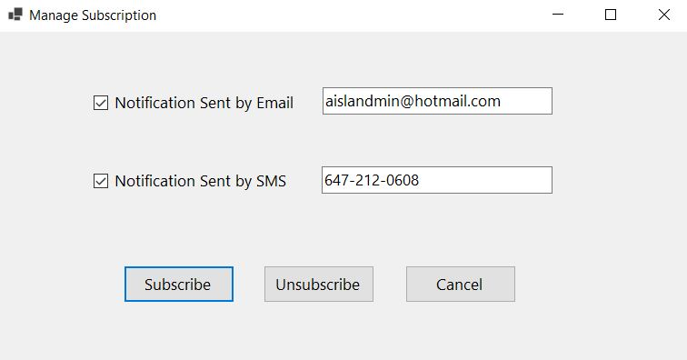

# Notification Management System
In the real world, the notification management system consists of two parts, one is to allow clients to subscribe/unsubscribe to the notification, and another part is to facilitate administrator(s) to publish the 
notification. This task is to implement a C# WinForm application to mimic notification management system by using delegate. 
The system facilitates clients to subscribe/unsubscribe notification as well as send notification to all subscribers. And the system needs to make sure that the provided email address is valid and provided cell 
phone number follows the specified format.

## Launched
After the app has been launched, following GUI should be presented. As there is no subscriber yet when the application just launches, “Publish Notification” button is disabled.

## Manage Subscription
After Manage Subscription button clicked, following GUI should be popped up to allow clients to subscribe or unsubscribe notification. If an invalid email address has been provided, error message should be provided.

## Publish Notification 
After Publish Notification button clicked, following GUI is presented to facilitate notification publish. 

**Note**: No duplication subscription is allowed; in other words, if the user tries to subscribe using same email multiple times, the application should not allow it.
